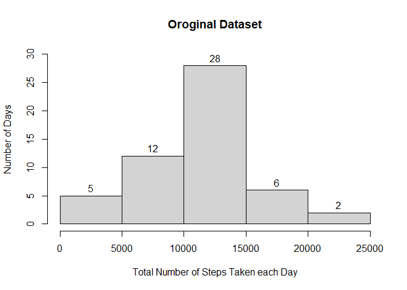
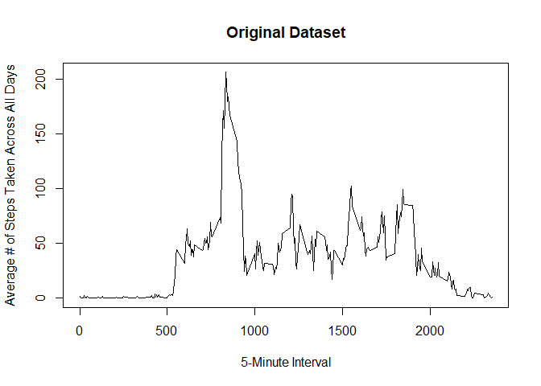
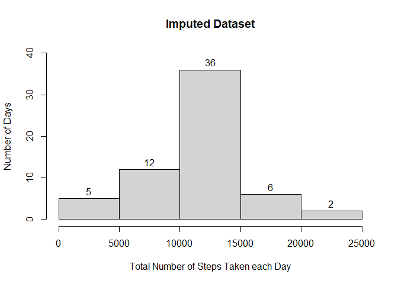
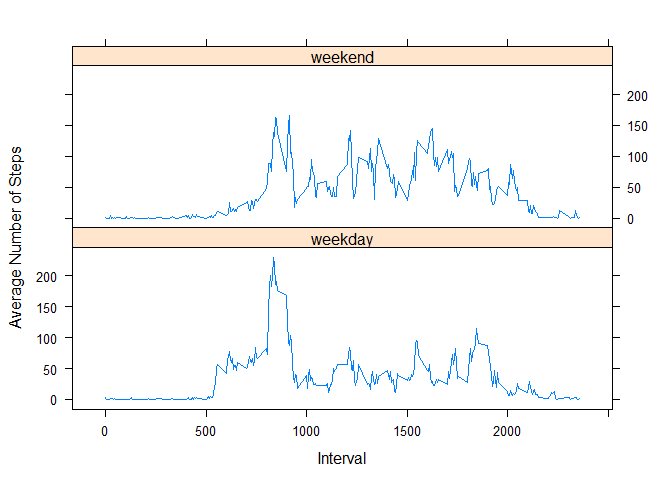

## Loading and preprocessing the data

The data provided for this assignment is loaded below using `read.csv()`
function. The data is described in the **README.md** file.


```r
DF <- read.csv("activity.csv")
```

After  the data is loaded the **date** column is converted from *character* to *Date* type. Then the missing values are coded as `NA` are removed for further
processing of the data.


```r
DF$date <- as.Date(DF$date,"%Y-%m-%d")
DF2 <- DF[complete.cases(DF),]
```

## What is mean total number of steps taken per day?

1. The code below show calculation of the total number of steps taken per day. To do so, the dataset with `NA` removed is used along with the **Date** column as a categorical variable.


```r
totalsteps<-tapply(DF2$steps,as.factor(DF2$date),sum)
```

2. The code below produces the histogram of the total number of steps taken each day.


```r
hist(totalsteps,ylim=c(0,30),xlab="Total Number of Steps Taken each Day",
     ylab="Number of Days",labels = TRUE,main = "Oroginal Dataset")
```

<!-- -->

The histogram shows that for the total number of steps taken each day ranges
between 10,000 and 15,000 more often.

3. The mean and median of the total number of steps taken per day can be
calculated using the code below.


```r
tsmean<-mean(totalsteps)
tsmedian<-median(totalsteps)
```

* Mean of the total number of steps taken per day is 10766.19
, and
* Median of the total number of steps taken per day is 10765.

The mean and median values are close to each other and they can be verified visually from the above histogram.

## What is the average daily activity pattern?

Now, we will generate a time series plot of the 5-minute interval (x-axis) and the average number of steps taken, averaged across all days (y-axis). To do so,
first, we will calculate average number of steps taken for each interval, averaged across all days. Then the average values are plotted as required.


```r
tsavg<-tapply(DF2$steps,as.factor(DF2$interval),mean)
plot(x=as.numeric(names(tsavg)),y=tsavg,type="l",xlab="5-Minute Interval",
     ylab="Average # of Steps Taken Across All Days",
     main = "Original Dataset")
```

<!-- -->

The code below identifies the 5-minute interval, on average across all the days in the dataset, which contains the maximum number of steps.


```r
tsavg[which.max(tsavg)]
```

```
##      835 
## 206.1698
```

```r
names(tsavg[which.max(tsavg)])
```

```
## [1] "835"
```

The 835 th 5-minute interval contains the maximum number of steps of 206.1698 averaged across all the days, which can be verified from the time series plot above.

## Imputing missing values

1. Calculate and report the total number of missing values in the dataset (i.e. the total number of rows with `NA`s)


```r
nnas<-sum(is.na(DF$steps))
```

The total number of missing values in the dataset is 2304.

2. Each missing *step* value in the dataste is replaced with the mean for that 5-minute interval (mean over all days).


```r
DF3<-cbind(DF)
tsavgdf<-data.frame("tsavg"=tsavg,"interval"=as.integer(names(tsavg)))
for (i in 1:dim(DF3)[1]){
    if(is.na(DF3$steps[i])){
        DF3$steps[i]<-tsavgdf[tsavgdf$interval == DF3$interval[i],1]
    }
}
```

3. The new dataset that is equal to the original dataset but with the missing data filled in is saved as **DF3** *data.frame*.

4. The histogram of the total number of steps taken each day is generated again using the new dataset.


```r
totalsteps3<-tapply(DF3$steps,as.factor(DF3$date),sum)
hist(totalsteps3,ylim=c(0,40),xlab="Total Number of Steps Taken each Day",
     ylab="Number of Days",labels = TRUE,main = "Imputed Dataset")
```

<!-- -->

The mean and median of the total number of steps taken per day is calculated again using the new (i.e., imputed) dataset.


```r
tsmean3<-mean(totalsteps3)
tsmedian3<-median(totalsteps3)
```

* Mean of the total number of steps taken per day from the new dataset is 10766.19
, and
* Median of the total number of steps taken per day from the new dataset is 10766.19.

The **mean** and **median** values from the imputed dataset are not significantly different from the same values from the original dataset. Therefore, the impact of imputing missing data on the estimates of the total daily number of steps is minor.

## Are there differences in activity patterns between weekdays and weekends?

For this part, we will use `weekdays()` function and the dataset with the filled-in missing values.

1. First we will create a new factor variable *wday* in the dataset with two levels -- "weekday" and "weekend" indicating whether a given date is a weekday or weekend day.


```r
DF3$wday<-rep("weekday",dim(DF3)[1])
DF3$wday[weekdays(DF3$date) == "Sunday"]<-"weekend"
DF3$wday[weekdays(DF3$date) == "Saturday"]<-"weekend"
DF3$wday<-as.factor(DF3$wday)
```

2. Now we will make a panel plot containing a time series plot of the 5-minute interval (x-axis) and the average number of steps taken, averaged across all weekday days or weekend days (y-axis). For this plot generation, we will use **lattice** package.


```r
tsavg_days<-tapply(DF3$steps,list(as.factor(DF3$interval),DF3$wday),mean)
tsavg_df1<-data.frame("interval"=as.numeric(row.names(tsavg_days)),
                     "tsavg"=tsavg_days[,2],
                     "wday"="weekend",row.names = NULL)
tsavg_df2<-data.frame("interval"=as.numeric(row.names(tsavg_days)),
                      "tsavg"=tsavg_days[,1],
                      "wday"="weekday",row.names = NULL)
tsavg_df<-rbind(tsavg_df1,tsavg_df2)
tsavg_df$wday<-as.factor(tsavg_df$wday)
library(lattice)
xyplot(tsavg ~ interval | wday, data = tsavg_df, layout = c(1, 2),type="l",
       xlab="Interval", ylab = "Average Number of Steps")
```

<!-- -->
